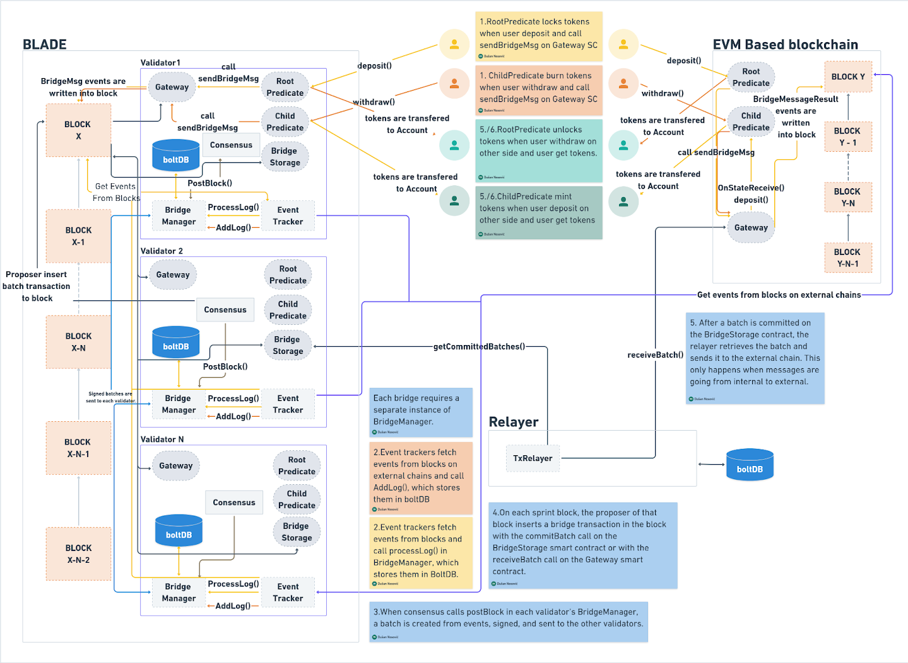

# Asset Transfer Workflow

## Internal to External Chain

The process of transferring assets from the internal to the external chain consists of the following steps:

1. **Deposit Initiation**\
   When a user wants to transfer a specific token from the internal to the external chain, they call the `deposit` method of the `RootPredicate` smart contract for that token.\
   This method invokes the `sendBridgeMsg` function of the `Gateway` smart contract.
   * This function performs validation.
   * Emits an event containing all necessary data for the token transfer to be executed successfully (e.g., message, token amount, sender, recipient, etc.).
2. **Event Listening and Batch Creation**\
   Validators listen for events emitted by the `sendBridgeMsg` function of the `Gateway` contract.\
   Based on these events, they create **batches**.
3. **Batch Commitment**\
   On the **sprint block**, the proposer commits (stores) the batch that the validators have agreed upon.\
   This is done by calling the `commitBatch` method of the `BridgeStorage` smart contract.
   * Each batch includes metadata (source/destination chain, signatures, etc.) and the messages (token transfer details).
   * Each committed batch is assigned a unique **batch ID** (a sequential number).
4. **Batch Retrieval by Relayer**\
   The relayer periodically (e.g., every 10 seconds) calls the `getBatches` method of the `BridgeStorage` contract.
   * Argument: batch ID
   * Returns: all committed batches with IDs **greater than or equal to** the provided one.
   * The argument is determined by the relayer’s internal logic (tracking processed/unprocessed batches).
5. **Receiving the Batch on the External Chain**\
   For each unprocessed batch, the relayer calls the `receiveBatch` method of the `Gateway` contract on the **external chain**.
   * The relayer forwards the batch data **unmodified**, exactly as received from the `getBatches` method.
   * The argument type of `receiveBatch` is **identical** to the element type of the list returned by `getBatches`.

***

## External to Internal Chain

With a few key differences, transferring tokens from the external to the internal chain generally follows the same overall logic. The step-by-step differences are:

1. **Deposit Initiation (External Chain)**\
   Users call the `deposit` method of the `RootPredicate` smart contract for the desired token **on the external chain**.
2. **Event Listening and Batch Creation**\
   Validators listen for events emitted by the `sendBridgeMsg` method of the `Gateway` contract **on the external chain**.
3. **Batch Processing (Different Role)**
   * Instead of calling `commitBatch` on the `BridgeStorage` contract, the **proposer** (not the relayer) calls the `receiveBatch` method of the **blade Gateway** contract.
   * This step occurs on the **sprint block** (usually performed by the relayer in the internal-to-external flow).
   * Within `receiveBatch`, before executing the messages, the batch is **committed** by calling the `commitBatch` method of the `BridgeStorage` contract.

<figure><figcaption>
Flow diagram.
</figcaption></figure>
