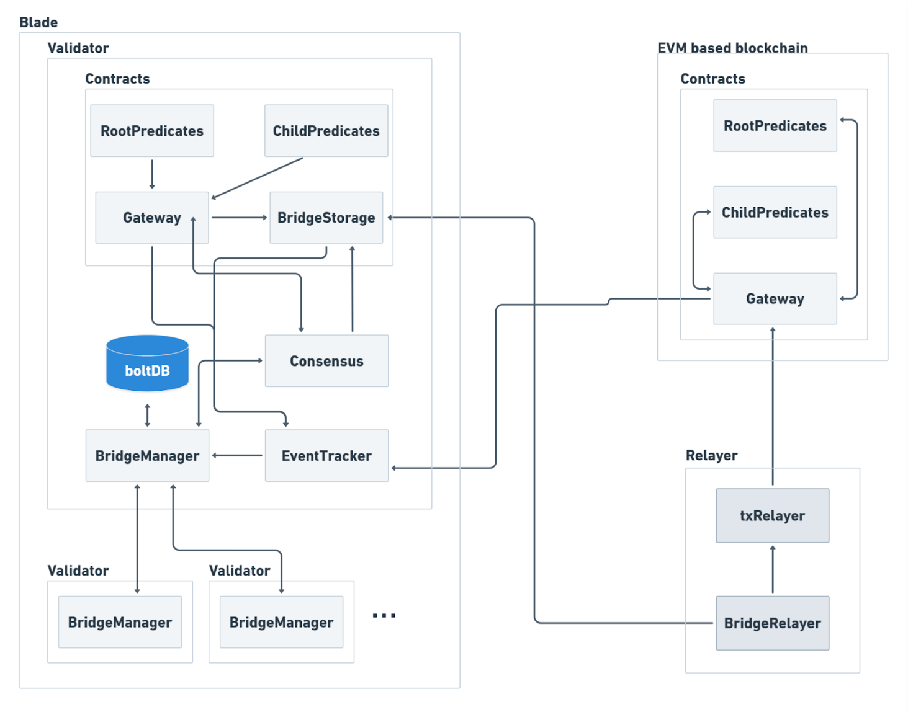

# Components

Blade’s bridge feature consists of a set of contracts and modifications on Blade itself to allow seamless integration. Below is a list of components with brief descriptions:

## Predicate Contract Pairs

`RootTokenPredicate` and `ClientTokenPredicate` represent contract pairs for each of the supported tokens—such as **ERC20**, **ERC721**, and **ERC1155**.

* For example, the ERC20 tokens contract pair consists of `RootERC20Predicate` and `ChildERC20Predicate`.
* The **Root Predicate** is deployed on the **source chain** and represents the starting point for sending tokens.
* The **Child Predicate** is deployed on the **destination chain** and is responsible for receiving the assets.

> This represents Blade's implementation of predicate contracts, but other implementations are also possible.

## Gateway Contract

The **Gateway** smart contract is deployed on both the internal and external sides.

* Each bridge has its own copy of the Gateway contract on Blade.
* On the **source side**, the Gateway contract **emits events** containing data about the message to be transferred.
* On the **destination side**, it **processes these events** and executes the corresponding logic.

The bridge officially **starts and ends** at the Gateway contracts. Custom implementations before and after Gateway contracts are supported. The only requirement is:

* Call `sendBridgeMsg()` on the source Gateway contract.
* Implement the `IStateReceiver` interface on the destination side.

## BridgeStorage Contract

Deployed **only on the internal chain**, the `BridgeStorage` contract is responsible for:

* Storing batches.
* Verifying batches before storing.
* Calling the `ValidatorSetStorage` contract to verify batch signatures.

## ValidatorSetStorage Contract

Also deployed **only on the internal chain**, this contract:

* Stores the current validator set.
* Verifies signatures.

## Validator Node

Plays a **crucial role** in preparing, proposing, and applying bridge transactions to the blockchain.

Responsibilities:

* Tracks smart contract-emitted events using an **EventTracker** component.
* Processes events by validating their details.
* Stores them in a local database (BoltDB).
* Creates a batch of transactions.
* Signs the batch using a **BLS signature**.
* Publishes the batch for voting by other validators.

## Relayer Node

The **Relayer Node** monitors and processes bridge events on the blockchain, continuing the work of the Validator Node.

It handles two key events:

1. **`NewBatchEvent`**
   * Emitted by the `commitBatch` method in the `ValidatorSetStorage` contract.
   * The relayer calls the `receiveBatch` method from the `Gateway` contract to process each transaction in the batch on the remote `ClientTokenPredicate` contract.
2. **`NewValidatorSetEvent`**
   * Emitted by the `commitValidatorSet` method in the `ValidatorSetStorage` contract.
   * Indicates a new validator set has been confirmed and made official.

<figure><figcaption>
Component diagram.
</figcaption></figure>
