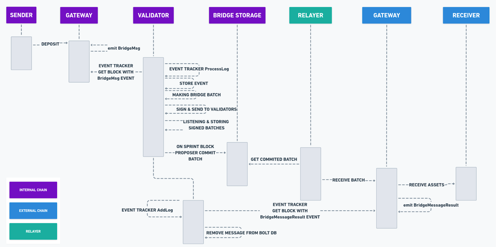
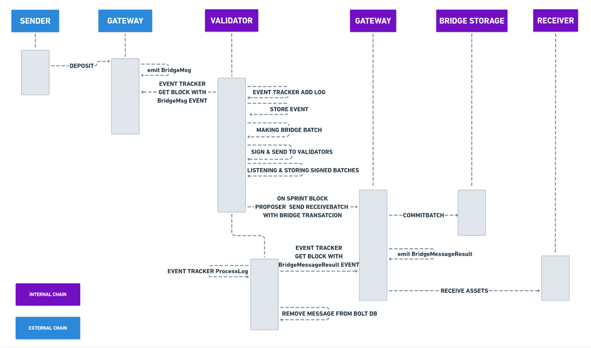

# Gateway

## Gateway Contract

The `Gateway` contract plays a central role between the `Root` and `Client` Predicate contract pair. It is responsible for the following:

* **Emitting `BridgeMsg`** for each successful deposit or withdrawal, thereby logging the event to the chain.
  * These messages are used by the **Relayer** to batch multiple transaction transfers and eventually execute them on the destination end during deposit or withdrawal operations.
* **Providing the `receiveBatch` API function**, which is called by the Relayer to send the tokens to the destination chain.
* **Handling non-relayer scenarios**:
  * When a token moves from an external network to an internal one without using a Relayer, the internal `Gateway` contract **notifies the `BridgeStorage` contract** of a new batch.
  * This notification is necessary because, in such scenarios, commits are not made directly to `BridgeStorage`.

***

## Assets transfer

### Internal to External

The following is the sequence diagram of the **deposit call from the internal to the external chain**, with a focus on contract execution.\
Sequence diagrams are created for:

* `RootERC20Predicate` (sender)
* `ChildERC20Predicate` (receiver)

<figure><figcaption>
Sequence diagram: Internal to External assets transfer.
</figcaption></figure>

***

### External to Internal

This sequence diagram shows the **sequence of calls when funds are deposited from the external to the internal chain**.\
It is similar to the previous diagram but illustrates the sequence of events in the opposite direction.

<figure><figcaption>
Sequence diagram: External to Internal assets transfer.
</figcaption></figure>
