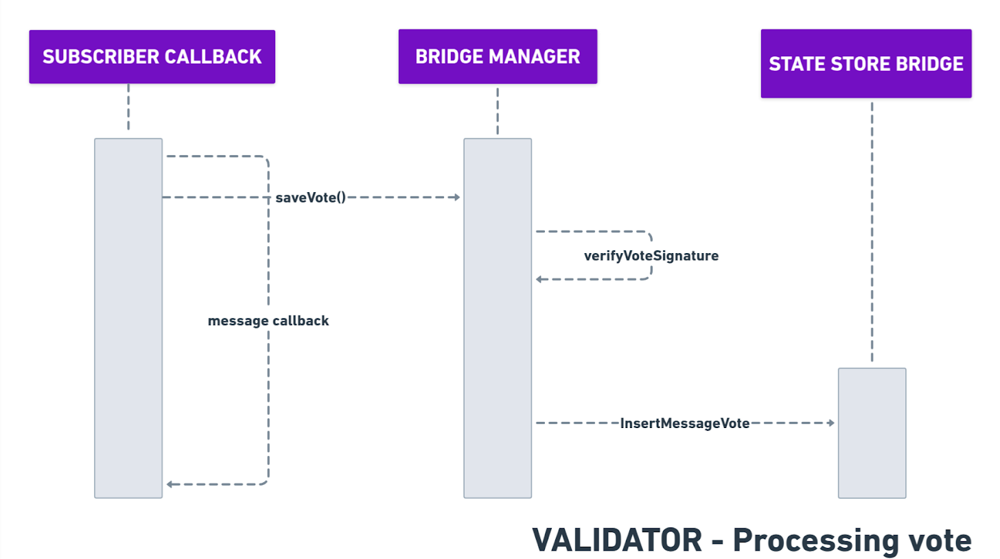

# Batch Voting

***

## Overview

* The **first vote** for each batch is created during **batch creation**.
* This initial vote is then **published to other validators** using the **P2P communication mechanism**.

***

## Voting Process

1. **Batch Creation**
   * Each validator independently creates the same batch.
2. **Vote Publishing**
   * After batch creation, the validator sends out its vote to other validators via P2P.
3. **Vote Exchange**
   * Validators exchange votes for the same batch with each other.
4. **Vote Score Update**
   * The **subscriber callback** handles incoming votes and updates the **voting score**.
   * This update reflects in the **Bridge Message Store**, increasing the vote count for the corresponding batch.

***

<figure><figcaption>
Sequence diagram of the voting process.
</figcaption></figure>
