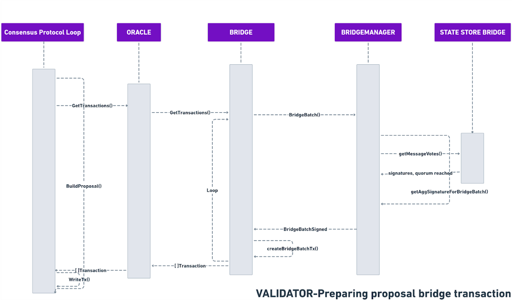

# Bridge Transaction

Every sprint block, the **proposer** verifies whether a batch has reached the required voting quorum. If such a batch exists, a **bridge batch transaction** is created for inclusion in the current block. This process is handled by the `createBridgeBatchTx()` function, which ensures that the batch is properly formed and ready for inclusion.

***

## Batch Direction and Handling

### External to Internal

* The proposer sends a transaction to `Gateway.receiveBatch()`.
* This reduces costs as the relayer does not need to send anything to the internal chain.
* It also speeds up the process by removing an extra step.

### Internal to External

* The `BridgeStorage` contract stores the batch result.
* It invokes `BridgeStorage.commitBatch()`, finalizing the batch and emitting the `NewBatch` event.

***

## Role of `BridgeStorage` and `NewBatch` Event

* Storing batches in `BridgeStorage` allows **relayer nodes** to detect and transmit batches to external networks.
* The `NewBatch` event is crucial for **validators**, who listen for it and mark the batch as an **unexecuted slice**.
* This is critical for the **retry mechanism**, ensuring that failed batches can be retried and are not lost.

***

## Sequence Overview

The entire process of creating a proposal for a bridge batch and its handling involves the following components:

* **Proposer**
* **Gateway contract**
* **BridgeStorage contract**
* **Relayers**
* **Validators**

These participants interact in a defined sequence to manage batch processing across networks, including quorum verification, commitment, and execution of batches.

***

<figure><figcaption>
Sequence diagram preparing proposal.
</figcaption></figure>
