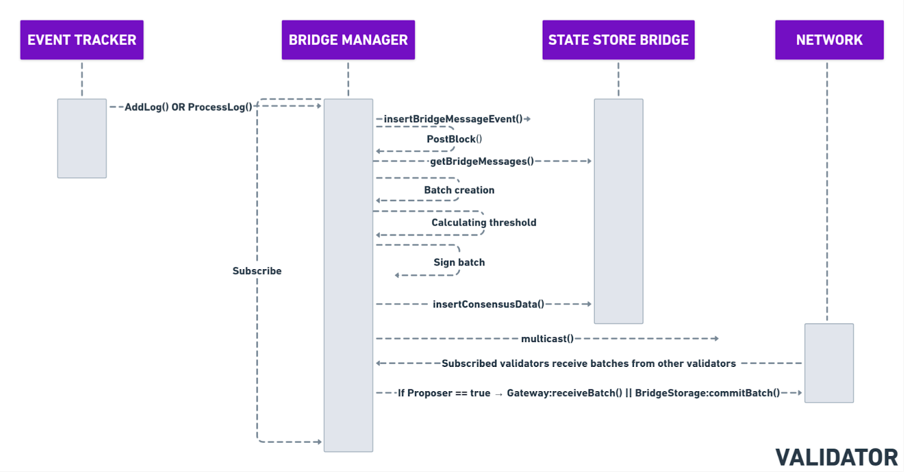

# Building the Bridge Batch

***

## Pending batch creation process

The process of building a bridge batch by the **Bridge Manager** is outlined below:

1. **Validator check**
   * Batch building is only permitted on a **validator node**.
   * The system first verifies this condition before proceeding.
2. **Event Retrieval**
   * Starting from the **index of the last processed ID** (stored on the `BridgeStorage` contract), the system
     * Reads up to `maxNumberOfEvents` from the `BridgeMessageStore` (BoltDB bucket).
3. **Batch Creation**&#x20;
   * A **pending batch** is created.
   * A **BLS(Boneh-Lynn-Shacham)** signature is generated based on the batch hash.
     * BLS signatures enable efficient aggregation of validator signatures.
4. **Vote Insertion**
   * The validator:
     * Inserts its own message vote.
     * Sends this vote to other validators.
5. **Listen for Votes**
   * Validators listen for incoming votes from other nodes.
   * Votes for each batch are stored in **BoltDB**.
6. **Storing of a Pending Batch**
   * The batch is marked and stored as **pending.**

***

## Parallel Execution and Voting

* This entire process is executed **in parallel by each validator node**.
* Validators that build the **same batch**:
  * Publish and receive votes for it.
* If a **voting quorum** is reached:
  * The corresponding **bridge transaction** (containing the selected events) is included in the **current sprint block**.

***

<figure><figcaption>
Sequence diagram: Build batch.
</figcaption></figure>
