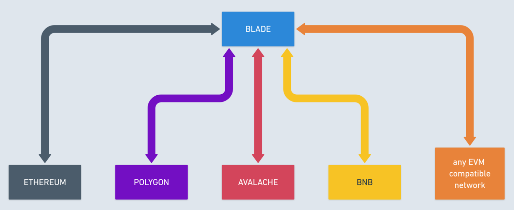

# High-Level Architecture

A blockchain bridge enables the exchange of assets and data between two networks. In the case of **Blade**, it facilitates interactions between the Blade network and multiple other networks.

Various naming conventions exist in the literature for these networks, such as:

* Layer 1 (L1) and Layer 2 (L2) networks
* Parent network and child network
* Root chain and side chain

We use terms:

* **Internal chain/network**: Refers to the primary blockchain (Blade)
* **External chain/network**: Refers to the connected networks

Both the internal and external chains can serve as **sources of messages**. Depending on the source, either chain can act as the **destination**.

* The chain from which the gateway emits the `BridgeMsgEvent` is referred to as the **Source chain**.
* The chain to which the gateway sends the message is referred to as the **Destination chain**.

In the following sections, we will use the terms **Source** and **Destination** accordingly.

Assuming that the Blade chain and its consensus protocol are central to the bridge mechanics, the architecture of the overall system is illustrated below.

<figure><figcaption>
High-Level architecture
</figcaption></figure>
