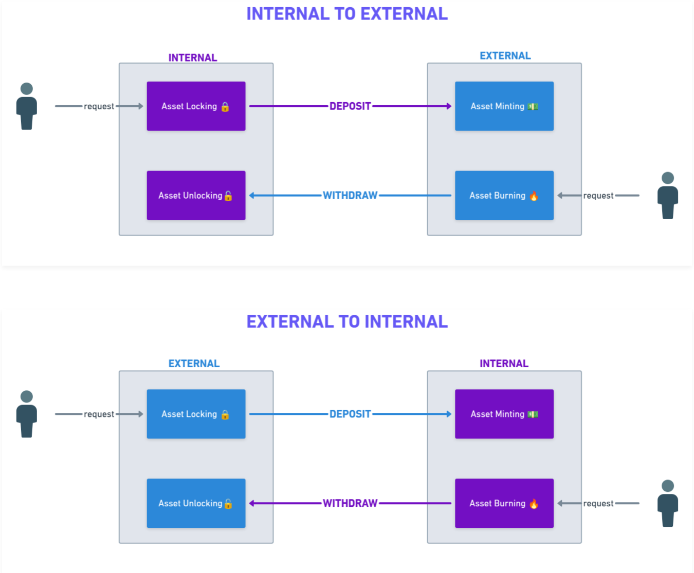

# Process of Token Transfer via Bridge

The process of token transfer depends on the direction of the transfer. Below are the details for both scenarios:

***

## Transferring from Internal Chain to External Chain

### Deposit

* When a user wants to transfer tokens from the internal chain, they **send their tokens to the external network**.
* These tokens are **locked on the internal chain**, keeping them safe in an escrow-like service. This prevents spending the tokens until they are withdrawn, maintaining the token supply consistency.
* After the tokens are locked, a **corresponding amount of tokens is minted** on the external chain by a bridge contract deployed on the external network.

### Withdraw

* To transfer tokens back to the internal network, the user initiates a transaction that **burns the transferred tokens on the external chain**. Burning the tokens removes them from circulation on the external chain.
* Once the tokens are burned, the bridge contract on the internal network **unlocks the previously locked tokens** and transfers them to the user's address on the internal network.

***

## Transferring from External Chain to Internal Chain

### Deposit

* When users want to transfer tokens from the external chain, they **send their tokens to the internal network**.
* The process is similar to the previous case, with a few minor differences:
  * Instead of being locked on the internal network, assets are locked on the **external network**.
  * On the internal side, tokens are **minted**.

### Withdraw

* To transfer tokens back from the external chain, a transaction is initiated that **burns tokens on the internal network**.
* After the tokens are burned on the internal side, they are **unlocked and transferred** to the user's address on the external network.

***

## Ilustration

The following image illustrates the asset operations based on the flow direction:

<figure><figcaption>
Asset operations based on the flow direction.
</figcaption></figure>
