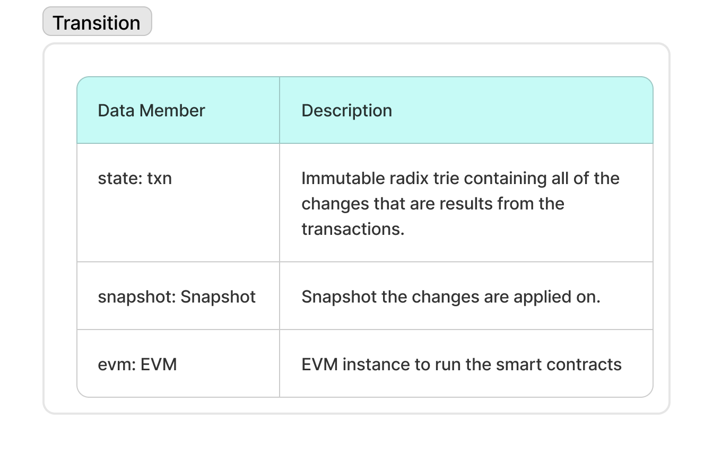

# State Transition

A `Transition` instance is responsible for processing a **series of transactions** sequentially on a given **snapshot**.

## Structure

* A `Transition` consists of:
  * A **snapshot** (the base state on which the transition operates)
  * A `Txn` instance, which references the **same snapshot**

## Behavior

* During transaction execution, the `Transition` maintains a set of **receipts**.
* All **read** or **update** operations on the World State Trie (WST) are performed through the `transition.state.Txn` object.
* `state.Txn` is an instance of an **immutable radix trie** (iradix), ensuring:
  * The original **snapshot remains unchanged**
  * **All changes are captured** in an isolated, accessible structure

## Diagram

The structure and data members of the `Transition` object are shown in the following image:

<figure><figcaption>
Transition data structure.
</figcaption></figure>
