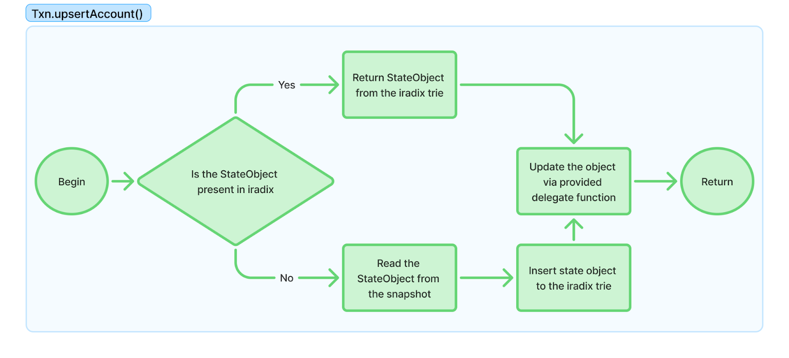
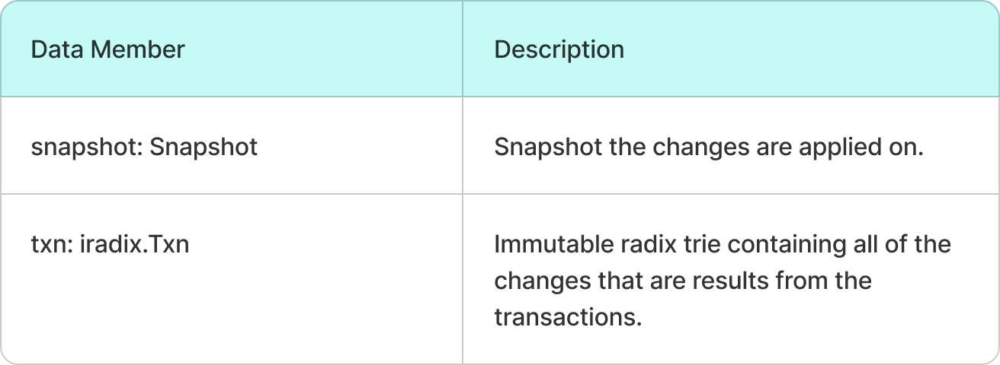
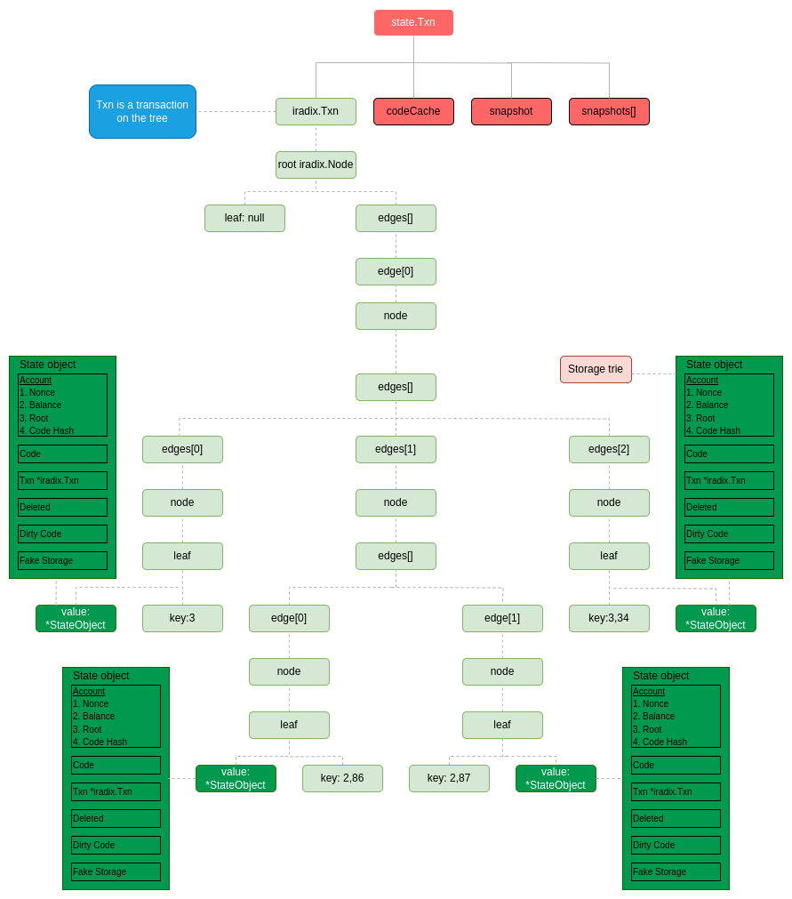

# State Txn

`State.Txn` is a wrapper class around [`hashicorp/go-immutable-radix`](https://github.com/hashicorp/go-immutable-radix) (**iradix**).

* It is used to perform temporary, in-memory modifications to the state.
* The `Txn.upsertAccount()` function is used to modify existing nodes, as illustrated in the chart below:

<figure><figcaption>
Flowchart of Txn.upsertAccount()
</figcaption></figure>

## How It Works

When updating a `Txn`:

* The original **Snapshot** remains unchanged.
* All changes are stored in the **iradix trie**, which is immutable and efficient for such use cases.

## Data Members

`state.Txn` contains the following data members:

* \[List key fields or describe members here, if known or applicable]

<figure><figcaption>
state.Txn data structure.
</figcaption></figure>

## Example

An example structure of the **iradix trie** used within `state.Txn` is shown in the following image:

<figure><figcaption>
iRadix trie example.
</figcaption></figure>
