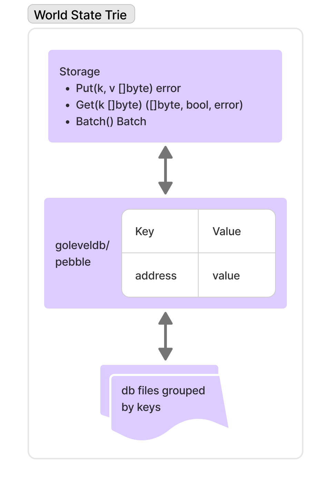

# Storage

The entire **World State Trie (WST)** is stored in a **key-value database** persisted on disk.

**Storage** serves as an abstraction layer for accessing the databases used to persist blockchain data.

* Currently, Blade uses **CockroachDB's Pebble** database.
* Previously, it used **GoLevelDB**.

The following image presents:

* The main **Storage API** functions
* A **high-level design diagram** of the storage layer

<figure><figcaption>
Storage example
</figcaption></figure>
