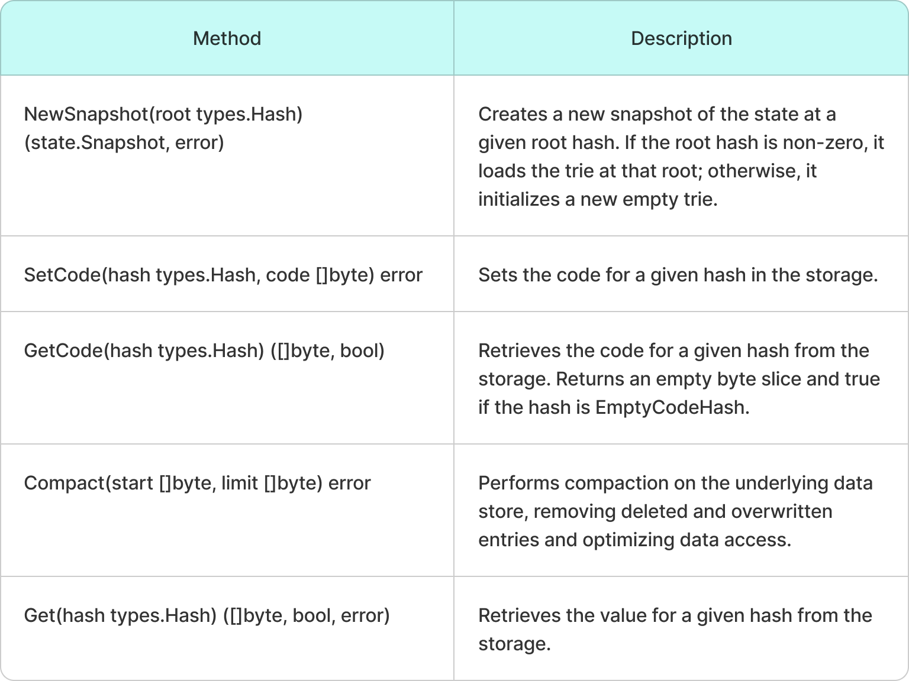

# State

The blockchain **WST** is accessed at the application level through a `State` object.

* `State` is a **wrapper around the Storage** layer.
* It includes an **LRU cache** to optimize access to disk-based data.
* The `State` object is used to **create a WST snapshot** at a specific root address, allowing for manipulation of the WST at that point in time.

The following class diagram illustrates the most important subset of methods provided by the `State` object:

<figure><figcaption>
A table listing the key methods.
</figcaption></figure>

