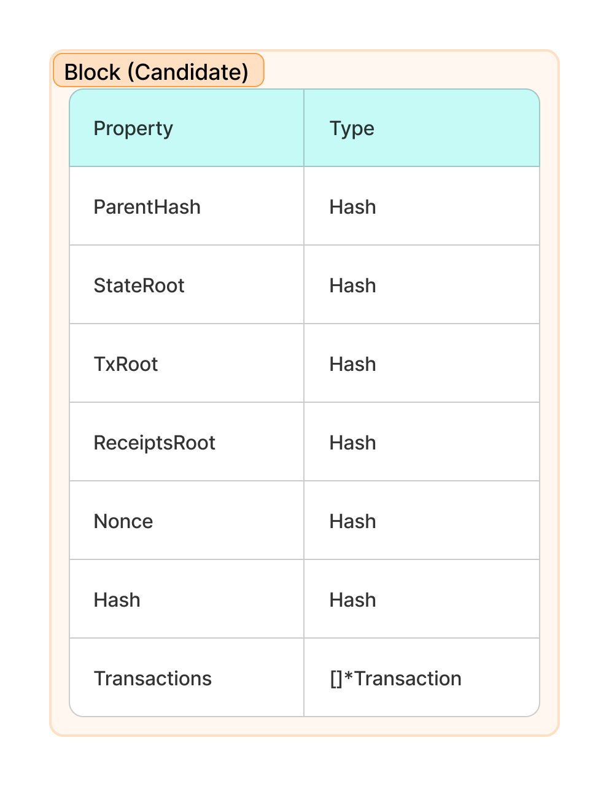
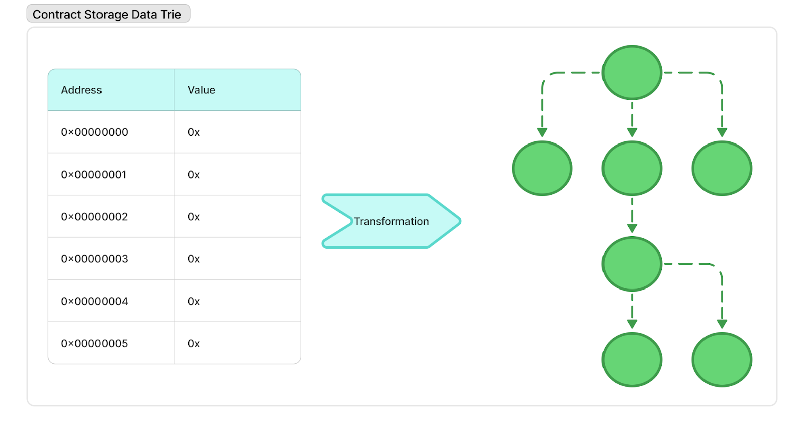
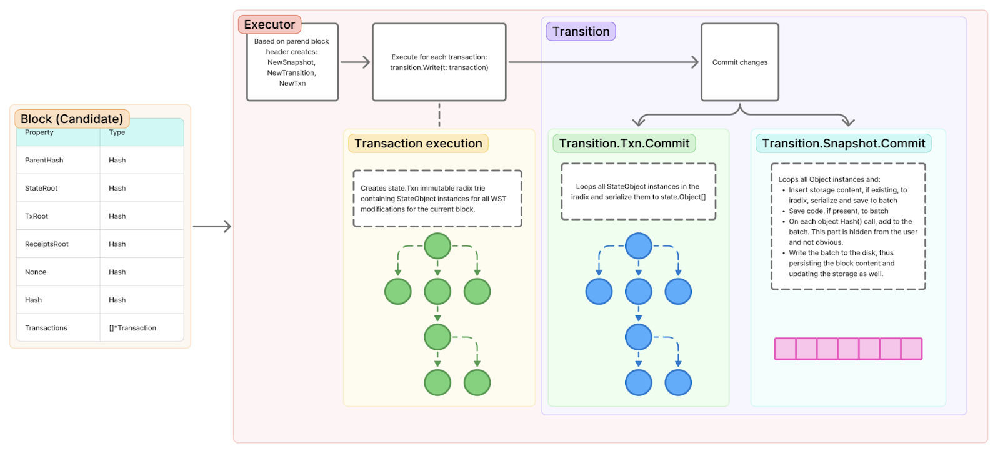

# World State Trie Update Dataflow

This chapter illustrates the **execution flow** when a set of transactions is executed against a specific **WST** during block building.

> 📝 **Note:** The process of selecting the block proposer, transaction set, etc., is out of scope for this document.\
> The description begins from the point where the **parent block** and **transaction set** are already determined.

***

## Block Candidate

A block candidate contains several data members (some omitted for brevity).

<figure><figcaption><p>Data structure of block candidate</p></figcaption></figure>

***

## Execution Overview

1. The **executor** creates:
   * A new `Snapshot`
   * A new `Transition`
   * A new `Txn`
2. The `Transition` is then used to **apply each transaction** to `state.Txn`.
   * At this stage:
     * `state.Txn` reads all the required data from **storage** via the **snapshot**
     * It updates the state
     * The updated data is stored in the **`iradix` field** of `state.Txn`

***

## Committing Changes

If all transactions execute successfully, the changes are committed to storage using `Transition.Commit()`.\
This consists of two main steps:

### 1. `Transition.Txn.Commit()`

* Walks through the `Transition.Txn.txn` **iradix trie**
* Serializes all modified `StateObject` instances
* Returns them as an array of `state.Object` instances

### 2. `Transition.Snapshot.Commit()`

* Writes the `state.Object[]` to persistent storage
* This process includes:
  * Creating an empty `state.trie.Txn` of type `itrie.Txn`
  * Populating `itrie.Txn` with all the prepared `state.Object` instances
  * Performing **RLP serialization** of the complete `itrie.Txn`
  * Storing the serialized trie to the persistent database using its **hash as the key**

This results in the creation of the **World State Trie**, as described in Ethereum's general documentation.

During this process, **Smart Contract (SC) storage** is converted from a **single-dimensional array-like structure** (used by the EVM) to an **`itrie.Txn`**, forming the **Account Storage Trie** as defined in Ethereum.

<figure><figcaption></figcaption></figure>

***

## Batch Writing Optimization

To enhance performance:

* All changes are first written to a **batch**
* Only at the end of processing are the changes **committed to persistent storage**

### Trie Serialization

Serialization of the trie is handled in the `itrie.Txn.Hash()` function, using logic like the following:

```go
tmp := val.MarshalTo(nil)

...

root = h.hash.Sum(nil)

if t.batch != nil {
    t.batch.Put(root, tmp)
}

```

## Transactions Trie and Receipts Trie in Ethereum

Ethereum uses a **minimalistic storage method** to manage transactions and receipts by storing their **Merkle root hashes** in the block header. This enables efficient and secure verification without storing all data directly in the header.

### Transactions Trie

* The **Transactions Trie** is stored as a hash in the block header field called `TxRoot`.
* This allows the full list of transactions in a block to be verified by computing the Merkle root of the transactions and comparing it to `TxRoot`.
* The root hash is computed using the `CalculateTransactionsRoot()` function.

### Receipts Trie

* The **Receipts Trie** is similarly stored in the block header as the `ReceiptsRoot` field.
* This allows verification of all transaction receipts within the block.
* The root hash of the receipts is calculated using the `CalculateReceiptsRoot()` function.

### Internal Structures and WST Updates

The following diagram illustrates how these internal structures are used in the updating of the **World State Trie (WST)**:

<figure><figcaption><p>Internal structures used for updating WST</p></figcaption></figure>


***

By leveraging these Merkle Patricia Tries, Ethereum ensures integrity, verification efficiency, and data minimization in its blockchain architecture.
